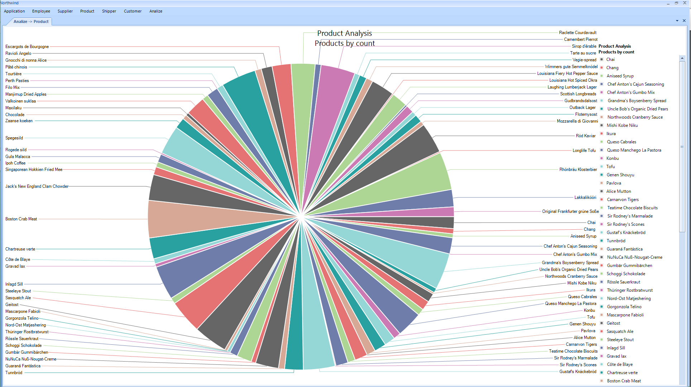

# NorthwindGenericGUI
Only the GUI layer for a separate ***Northwind*** *project*.  It meets the following guidelines:

 - Generic code/UI
 - Flexible UI
 - RWD
 - Call generic repositories

<i class="icon-list"> Goals
------------------------------
**Must have**
 1. Fulfill all guidelines
 2. Use Telerik components

<i class="icon-sitemap"> Implementation
------------------------------
In order to run the application the user will have to implement the DAL layer. In my project I used *EF* and the generic repository pattern.

The following class should be implemented.

    public class GenericRepository<T> : AbstractRepository<T>
        where T : class, new()
    {
        public virtual async Task<IQueryable<T>> Index()
        {
            // ...
        }

        public virtual async Task<T> Details(int? id)
        {
            // ...
        }

        public virtual async Task<T> Details(string id)
        {
            // ...
        }

        public virtual async Task<bool> Create(T entity)
        {
            // ...
        }

        public virtual async Task<bool> Edit(T entity)
        {
            // ...
        }

        public virtual async Task<bool> Delete(int? id)
        {
            // ...
        }

        public virtual async Task<bool> Delete(T entity)
        {
            // ...
        }
    }

The base class ** abstract AbstractRepository < T >** should implement:
 - private void GetIDName()
 - public String GetIDPropertyName()

** GenericGridView< T >** - based on the POCO model the GridView expands with new columns. (Screen 1)

**TextBoxFormFromModel< T >** - based on the POCO model the GridView expands with new components. (Screen 2)

** GenericTeeChart< T >** - based on the algorithm (strategy) used, the chart will display different. (Screen 3, 4, 5)

<i class="icon-ok"> End result
------------------------------

